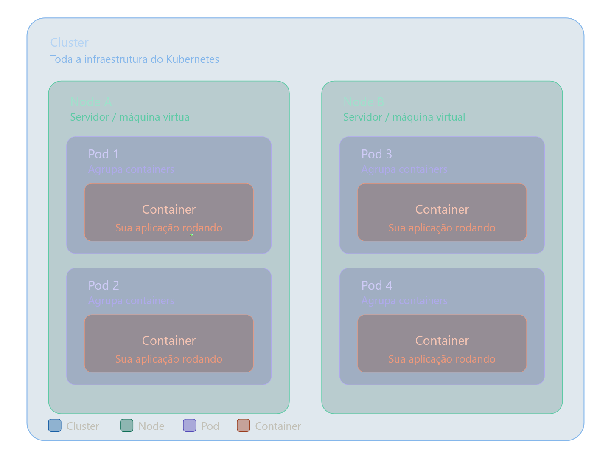

# Kubernetes

## Cluster
"guarda-chuva" de tudo — toda a infraestrutura do Kubernetes vive dentro dele. Você interage com o cluster como se fosse uma única entidade, mesmo que ele tenha dezenas de servidores por baixo.

## Node (nó)
Servidor real (físico ou virtual). O cluster pode ter quantos nodes forem necessários. Se um node cair, o Kubernetes redistribui os pods para os que ainda estão de pé.

## Pod
Menor unidade gerenciável do Kubernetes. Ele existe para empacotar e isolar os containers, garantindo que eles compartilhem a mesma rede e armazenamento. Na prática, a maioria dos pods tem um único container.

## Container
É onde sua aplicação de fato roda — o código, as dependências, tudo empacotado numa imagem Docker, por exemplo.