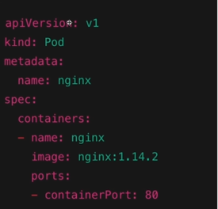

# Kubernetes (k8)

Simplifica o gerenciamento de containers. Contudo, é importante dizer que o K8 gerencia os pods.

O k8 trabalha com estado. Se foi definido um estado, por exemplo: ter 3 pods rodando, o k8 vai fazer de tudo para atender esse estado.

laboratório para testes: https://killercoda.com/

## Cluster
"guarda-chuva" de tudo — toda a infraestrutura do Kubernetes vive dentro dele. Você interage com o cluster como se fosse uma única entidade, mesmo que ele tenha dezenas de servidores por baixo.

- Conjunto de nós (servidores)

## Node (nó)
Servidor real (físico ou virtual). O cluster pode ter quantos nodes forem necessários. Se um node cair, o Kubernetes redistribui os pods para os que ainda estão de pé.

- Hospeda os pods;

## Pod
Menor unidade gerenciável do Kubernetes. Ele existe para empacotar e isolar os containers, garantindo que eles compartilhem a mesma rede e armazenamento. Na prática, a maioria dos pods tem um único container.

- Normalmente temos um container dentro de um pod, mas podemos ter mais um containers dentro de um pod. Contudo, a prática de ter mais de um container dentro do pod é relativamente avançada.

- Um pod pode ser criado via YAML (padrão), JSON, etc;

## Container
É onde sua aplicação de fato roda — o código, as dependências, tudo empacotado numa imagem Docker, por exemplo.

# Workloads

- Um workload é uma aplicação em execução;
- Os pods são agrupados em um Workload;

Para gerenciar esses workloads, o Kubernetes oferece alguns objetos prontos. Os principais são:

- `Deployment` → para aplicações stateless (APIs, frontends, etc.);
- `StatefulSet` → para aplicações que precisam guardar estado (bancos de dados);
- `DaemonSet` → garante que um pod rode em cada node (ex: agentes de monitoramento);
- `Job / CronJob` → para tarefas pontuais ou agendadas.

## ReplicaSet

É o objeto responsável por garantir que um número determinado de pods esteja sempre rodando. **Se um pod morrer, o ReplicaSet sobe outro automaticamente.**

- Trabalha com ReplicaSet: réplicas de pods;
- Podemos usar `deployments` para configurar as réplicas.

Com deployments podemos criar configurações que serão aplicadas para todos os pods dentro de um node.

### Deployments

Na prática, você raramente cria um ReplicaSet diretamente. Você cria um Deployment, e ele gerencia o ReplicaSet pra você.
O Deployment traz vantagens a mais:

- Define quantas réplicas você quer;
- Aplica configurações iguais para todos os pods (imagem, variáveis de ambiente, recursos, etc.);
- Permite atualizar os pods sem derrubar tudo de uma vez (rolling update);
- Permite reverter para uma versão anterior se algo der errado (rollback).

# InitContainer

É um container que roda antes da aplicação principal iniciar. Ele serve para preparar o ambiente.
Características:

- Roda até completar e encerra — não fica vivo junto com a aplicação
- Se falhar, o Kubernetes reinicia até ele ter sucesso
- Só depois que ele terminar, o container principal sobe

Exemplos de uso:

- Aguardar um banco de dados ficar disponível antes de subir a API;
- Baixar arquivos ou configurações necessárias;
- Rodar migrations.

# SideContainer

É um container que roda junto e ao mesmo tempo que a aplicação principal, dentro do mesmo Pod. Ele existe para complementar ou dar suporte à aplicação.

Características:

- Fica vivo enquanto o pod estiver rodando
- Compartilha a mesma rede e armazenamento do container principal
- Não substitui a aplicação — ele a apoia

Exemplos de uso:

- Coletar logs da aplicação e enviar para um serviço externo;
- Fazer proxy de rede (ex: Envoy no Istio);
- Sincronizar arquivos ou configurações em tempo real.