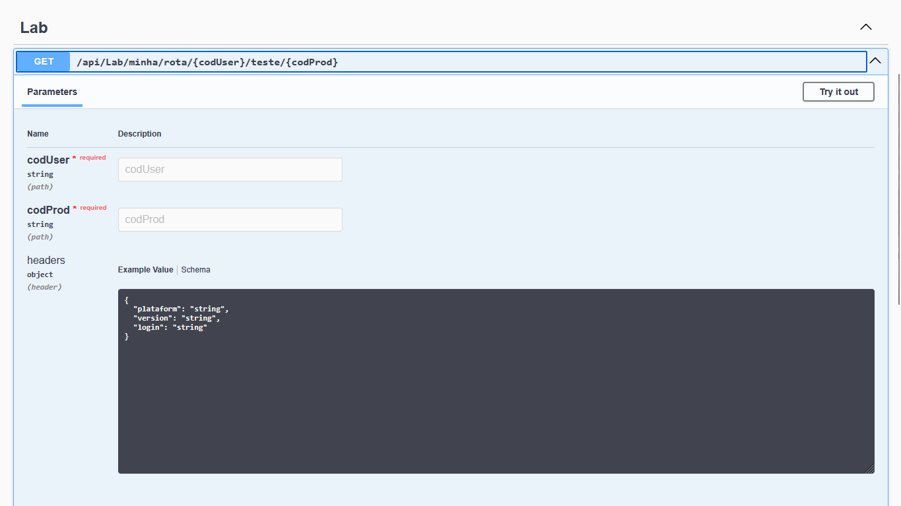
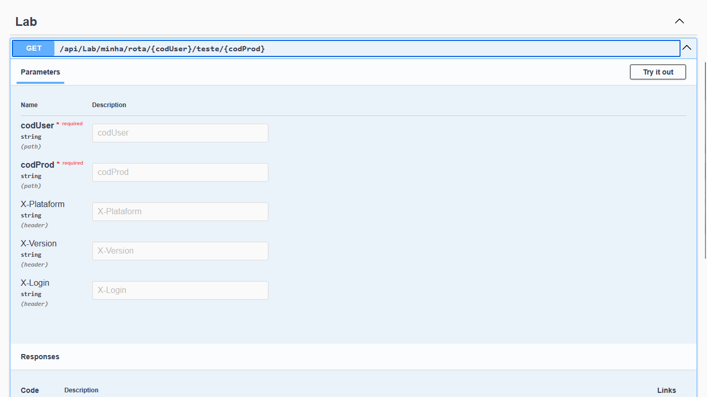

# Usando tipo complexo no FromHeader com Swagger

## Cenário
Ao usar um tipo complexo no `[FromHeader]`:
```c#
[HttpGet("minha/rota/{codUser}/teste/{codProd}/")]
public IActionResult Teste(
    [FromRoute] string codUser, 
    [FromRoute] string codProd,
    [FromHeader] RequestHeaders headers
    )
{
    Console.WriteLine($"Usuário: {codUser} - Cod prod: {codProd}");
    Console.WriteLine($"{headers.Login} - {headers.Platform} - {headers.Version}");
    return Ok();
}
```
O Swagger irá interpretar que os atributos de nosso tipo complexo `RequestHeaders` sejam enviados no formato json. Contudo, essa abordagem falha, pois o .NET não conseguirá fazer o bind para a nossa classe.


## Aplicando configuração (OperationFilter)
O código abaixo cria uma configuração que transforma cada atributo do objeto complexo usado no `[FromHeader]` em campos no Swagger.
```c#
using Microsoft.AspNetCore.Mvc;
using Microsoft.OpenApi.Models;
using Swashbuckle.AspNetCore.SwaggerGen;
using System.Reflection;
namespace Lab.Experiments.API.Configuration
{
    public class FromHeaderOperationFilter : IOperationFilter
    {
        public void Apply(OpenApiOperation operation, OperationFilterContext context)
        {
            foreach (var parameter in context.MethodInfo.GetParameters())
            {
                var headerProperties = parameter.ParameterType
                    .GetProperties()
                    .Where(p => p.GetCustomAttributes<FromHeaderAttribute>().Any());
                if (!headerProperties.Any())
                    continue;
                // Adiciona cada propriedade como header no Swagger
                foreach (var prop in headerProperties)
                {
                    var attr = prop.GetCustomAttribute<FromHeaderAttribute>();
                    operation.Parameters.Add(new OpenApiParameter
                    {
                        Name = attr?.Name ?? prop.Name,
                        In = ParameterLocation.Header,
                        Required = false,
                        Schema = new OpenApiSchema { Type = "string" }
                    });
                }
                var param = operation.Parameters.FirstOrDefault(o => o.Name == parameter.Name);
                operation.Parameters.Remove(param);
            }
        }
    }
}
```
Após montar o código acima devemos utilizar a configuração acima da seguinte forma:
```c#
builder.Services.AddSwaggerGen(options =>
{
    options.OperationFilter<FromHeaderOperationFilter>();
});
```
Feito isso, o swagger mudará a forma como apresenta nossos headers, consequentemente a forma como eles são enviados à nossa controller.
