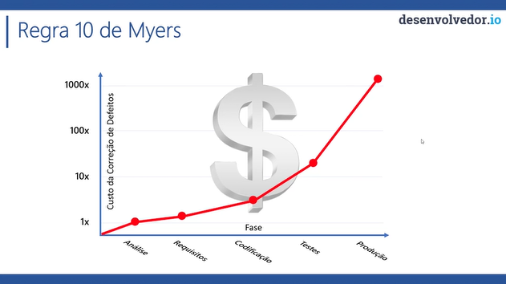

# Por que testar?

"Testar é o processo de executar um programa ou sistema com a intenção de econtrar defeitos (teste negativo)"
- Myers, 1979

Os testes permitem encontrar defeitos e garantir que o sistema está apresentando o resultado desejado.

# Como testar?

## Testes de caixa-preta
Realizados a nível de interface. Simulam usabilidade. Esses testes verificam se uma determinada ação realizada através da interface está se comportando como o esperado.

- Testes funcionais;
- Testes de regressão;
- Testes de UI (tela).

**Testes de alto nível.**

## Testes de caixa-branca
Realizados a nível de código fonte. Esses testes verificam se o código está se comportando como o esperado.

- Testes de unidade;
- Testes de carga;
- ...

**Testes de baixo nível.**

# Quadrante mágico do teste ágil

- Q1 - Testes de unidade e componente;
    - Automatizados. Você escreve o código para realizar testes;
- Q2 - Testes funcionais
    - Podem ser automatizados ou manuais;
    - Testes de história (story);
    - Protótipos;
- Q3 - Testes exploratórios
    - Manual;
    - Análisa cenários e usabilidade.
    - O que usuário precisa para usar aquele software.
- Q4 - Perfomance e teste de carga
    - Testes de segurança;
    - Utiliza ferramentas.

# Regra 10 de Myers

- Criada Glenford Myers;
- O custo da correção de defeitos é mais custoso quanto mais tarde o defeito é encontrado;
- Livro the art of software testing (1979);

Quanto mais tempo se leva para se descobrir um defeito, maior é o custo.

- Durante a análise, o custo é de 1x;
- Durante os requisitos, o custo é próximo de 1x;
- Durante os codificação, o custo é de aproximadamente 5x;
- Durante os testes, o custo é de passa de 10x;
- Após publicação em produção, o custo é de passa de 1000x;

**Quanto mais próximo de produção, mais caro será.**

# Como garantir a qualidade?

Organismos credenciadores > órgãos certificadores > normas

- Normas
    - ISO;
    - ABNT;
- Orgãos
    - Inmetro
- Organismos credenciadores
    - Sistemas de gestão em tecnologia da informação - OTI;
    - Sistemas de gestão ambiente - OCA.

# Tipos de testes mais comuns

## Testes de unidade

- Testa uma única unidade do sistema;
- É comum que a unidade seja uma classe;
- Testa um código, um comportamento, etc.
- Teste de uma controller, serviço, regra de negócio;
- Através do input A deve ser gerado um output B;
- Testa uma única unidade do sistema. Realiza o teste de maneira isolada, geralmente simulando as prováveis dependências que aquela unidade tem;
- É comum que a unidade seja uma classe;
- Teste de unidade não bate em infra.

## Testes de integração

- Testa a integração entre duas ou mais partes da sua aplicação;
- Testa a funcionalidade de ponta a ponta;
- **Os testes que você escreve para a sua classe PedidoService e PedidoRepository, por exemplo, onde seu teste vai até o banco de dados, é um teste de integração.**;
- Garante que as unidades da sua aplicação estão se integrando conforme o esperado.

## Testes automatizados

- Podemos considerar como teste de aceitação, funciona como um teste de caixa preta, já que o sistema é testado de ponta a através das operações executadas no sistema;
- O processo é executado como se fosse um usuário utilizando a aplicação;
- Pode ser considerado um teste de aceitação, pois neste teste além de garantir o funcionamento ponta a ponta, podemos validar características do negócio e funcionalidades;
- Pode ser considerado um teste de regressão, pois sua execução garante que a aplicação não regrediu, ou seja, que não surgiram novos defeitos em componentes que já estavam funcionando nas versões anteriores;
- Testes que rodam de forma autônoma;
- Ex: selenium;
- Utiliza uma ferramenta que abre um navegador, preenche o formulário, submete, etc...;

## Teste de cargas (load test)

- Consiste em testar as capacidades da aplicação, muitas vezes até seu limite, de forma que a aplicação não consiga mais responder;
- Relacionado a perfomance;
    - Testar a performance do código e componentes em situações extremas;
        - Ajuda a descobrir gargalos;
    - A aplicação funciona com 1 usuário? Com 10? Com 100? 1000?
    - Testar um possível balanceamento de carga no servidor ou até mesmo a escala elástica na nuvem;

# Boas práticas

## AAA - Arrange, Act e Assert

Prática que separa as etapas do teste da seguinte forma:

Arrange - Preparação, como criação dos mocks, instância, etc;
Act - Ação. Realização do testes;
Assert - Validação do teste.

