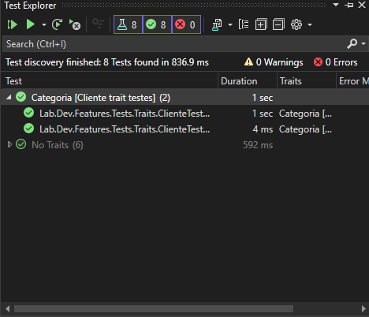
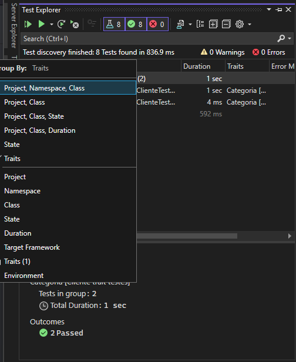

# Traits

Permite agrupar testes e definir um valor que facilita a visualização no Visual Studio.

- Marcações personalizadas;
- Ajuda a organizar os testes;


```c#
[Fact]
[Trait("Categoria", "Cliente trait testes")]
public void Cliente_NovoCliente_DeveEstarValido()
{
    // Arrange
    var cliente = new Cliente(
        Guid.NewGuid(),
        "Christian",
        "Bueno",
        DateTime.Now.AddYears(-30),
        "chr@email.com",
        true,
        DateTime.Now
    );

    // Act
    var result = cliente.EhValido();

    // Assert
    Assert.True(result);
    Assert.Empty(cliente.ValidationResult.Errors);
}
```



Pode ser que seja necessário alterar o `group by` do Visual Studio para usar os traits.



Para melhorar ainda mais a organização, pode-se aplicar um `DisplayName` no annotation `Fact`, deixando da seguinte forma:

```c#
[Fact(DisplayName = "Novo Cliente Válido")]
```